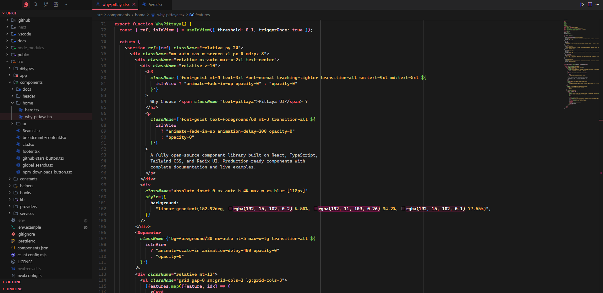

<div align="center">

# 🎨 Pittaya Theme

### A minimalist theme for VS Code inspired by the vibrant colors of dragon fruit

[](https://marketplace.visualstudio.com/items?itemName=pittaya-org.pittaya-theme)
[](https://marketplace.visualstudio.com/items?itemName=pittaya-org.pittaya-theme)
[](https://marketplace.visualstudio.com/items?itemName=pittaya-org.pittaya-theme)
[](https://marketplace.visualstudio.com/items?itemName=pittaya-org.pittaya-theme)
[](https://open-vsx.org/extension/pittaya-org/pittaya-theme)
[](LICENSE)
[](https://github.com/pittaya-ui/pittaya-theme)



</div>

---

## 🎉 Available on Multiple Marketplaces!

**Pittaya Theme is now published and available for everyone!**

- **[VS Code Marketplace](https://marketplace.visualstudio.com/items?itemName=pittaya-org.pittaya-theme)** — Official VS Code extensions marketplace
- **[Open VSX Registry](https://open-vsx.org/extension/pittaya-org/pittaya-theme)** — For Cursor, Windsurf, VSCodium and other VS Code alternatives

---

## ✨ Features

- **Two Beautiful Variants** — Dark and Light themes to match your environment
- **Minimalist Design** — Clean interface that lets your code shine
- **Eye-Comfort Optimized** — Carefully crafted palettes to reduce eye strain
- **Signature Pittaya Color** — Distinctive pink accents inspired by dragon fruit
- **Optimized for React/TypeScript** — Enhanced syntax highlighting for modern web development
- **Complete Go Support** — Comprehensive highlighting for Go with structs, interfaces, goroutines, and concurrency primitives
- **Extended Python Support** — Comprehensive highlighting for Python with decorators, type hints, f-strings, and more
- **Semantic Highlighting** — Advanced token colors for more accurate syntax representation
- **Green Accents** — Fresh green tones inspired by dragon fruit leaves
- **Excellent Readability** — High contrast colors for better code comprehension
- **Refined Syntax Highlighting** — Thoughtfully selected colors for different code elements
- **Modern UI** — Updated tab styles and interface elements

---

## 🎨 Color Palette

### Dark Theme

| Color | Hex | Usage |
|-------|-----|-------|
|  `Background` | `#1a1a1a` | Deep dark background |
|  `Foreground` | `#e8e8e8` | Clear, readable text |
|  `Primary` | `#ff637e` | Keywords, tags, primary elements |
|  `Secondary` | `#8fd460` | Functions, methods, brackets |
|  `Tertiary` | `#b8e986` | Types, attributes, props |
|  `Strings` | `#ffcc66` | String literals |
|  `Constants` | `#ff9eb3` | Constants, numbers |
|  `Comments` | `#707070` | Comments and documentation |

### Light Theme

| Color | Hex | Usage |
|-------|-----|-------|
|  `Background` | `#fafafa` | Ultra-light background |
|  `Foreground` | `#2a2a2a` | Dark, readable text |
|  `Primary` | `#d91656` | Keywords, tags, primary elements |
|  `Secondary` | `#2f9e44` | Functions, methods, brackets |
|  `Tertiary` | `#2b8a3e` | Types, attributes, props |
|  `Strings` | `#d97900` | String literals |
|  `Constants` | `#c2255c` | Constants, numbers |
|  `Comments` | `#909090` | Comments and documentation |

---

## 📦 Installation

### For VS Code (Official)

**Method 1: Via Extensions Panel**

1. Open VS Code
2. Go to Extensions (`Ctrl+Shift+X` / `Cmd+Shift+X`)
3. Search for **"Pittaya Theme"**
4. Click **Install**
5. Press `Ctrl+K Ctrl+T` and select **Pittaya Dark** or **Pittaya Light**

**Method 2: Direct Install**

[Install from VS Code Marketplace →](https://marketplace.visualstudio.com/items?itemName=pittaya-org.pittaya-theme)

**Method 3: Command Line**

```bash
code --install-extension pittaya-org.pittaya-theme
```

---

### For Cursor, Windsurf & Other IDEs

**Using Open VSX Registry:**

1. Open your IDE (Cursor, Windsurf, VSCodium, etc.)
2. Go to Extensions panel
3. Search for **"Pittaya Theme"**
4. Click **Install**
5. Activate the theme in your IDE settings

**Or install directly from:**

[Open VSX Registry →](https://open-vsx.org/extension/pittaya-org/pittaya-theme)

> **Note:** Cursor, Windsurf, and many VS Code alternatives use Open VSX Registry instead of the official VS Code Marketplace. Both registries have the same theme version!

### Local Development

If you want to contribute or test locally:

1. Clone this repository:
   ```bash
   git clone https://github.com/pittaya-ui/pittaya-theme.git
   ```

2. Copy the theme folder to your VS Code extensions directory:
   - **Windows**: `%USERPROFILE%\.vscode\extensions`
   - **macOS**: `~/.vscode/extensions`
   - **Linux**: `~/.vscode/extensions`

3. Reload VS Code

---

## 🚀 Future Plans

- [x] Enhanced TypeScript/TSX syntax highlighting
- [x] Optimized color scheme for React development
- [x] Green accent colors inspired by dragon fruit leaves
- [x] Semantic token colors for advanced highlighting
- [x] Create extension icon
- [x] Add screenshots and preview images
- [x] Publish to VS Code Marketplace
- [x] Create light theme variant
- [x] Extended Python support with decorators, type hints, and f-strings
- [x] Complete Go language support with structs, interfaces, and concurrency primitives
- [ ] Complete syntax highlighting for other major languages (Rust, Java, C++, etc.)
- [ ] Add theme customization options
- [ ] Create comprehensive documentation
- [ ] Community feedback integration

---

## 🤝 Contributing

Contributions are welcome! We'd love your help to make Pittaya Theme even better.

**Ways to contribute:**
- 🐛 Report bugs or issues on [GitHub Issues](https://github.com/pittaya-ui/pittaya-theme/issues)
- 💡 Suggest new features or improvements
- 🔨 Submit pull requests
- ⭐ Leave a review on the [Marketplace](https://marketplace.visualstudio.com/items?itemName=pittaya-org.pittaya-theme)
- 📝 Improve documentation

**Please read our [Contributing Guide](CONTRIBUTING.md) before submitting a PR.**

---

## 📄 License

MIT License - feel free to use this theme however you'd like!

---

<div align="center">

**Made with 💜 and inspired by the vibrant colors of nature**

[VS Code Marketplace](https://marketplace.visualstudio.com/items?itemName=pittaya-org.pittaya-theme) • [Open VSX](https://open-vsx.org/extension/pittaya-org/pittaya-theme) • [GitHub](https://github.com/pittaya-ui/pittaya-theme) • [Issues](https://github.com/pittaya-ui/pittaya-theme/issues)

</div>
